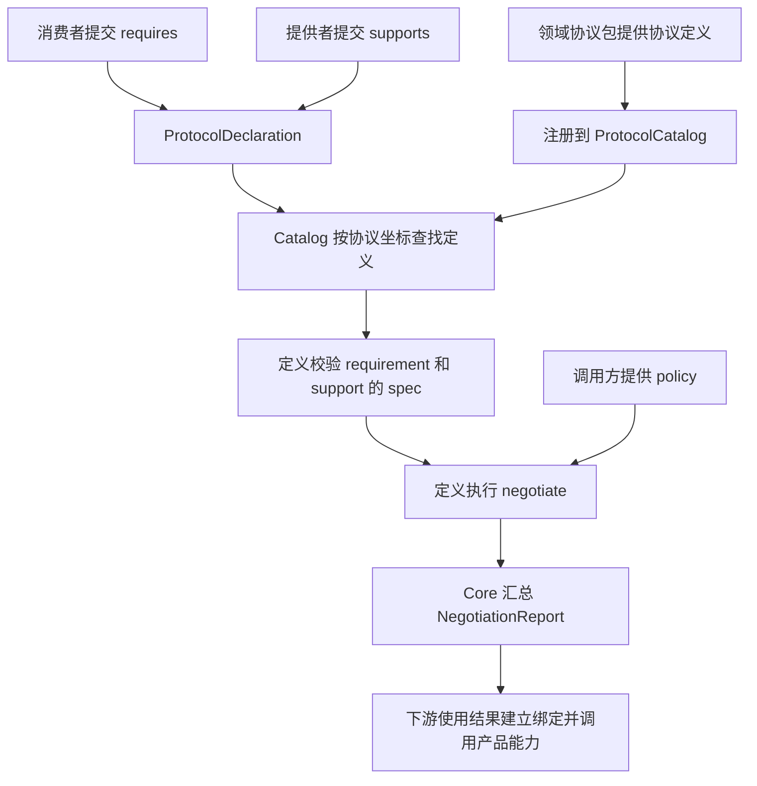

# std core 设计与接口说明

`@dsh-std/core` 为 std 的各个协议提供共同的声明和协商机制。一个参与者通过它说明自己需要什么、当前提供什么；协议定义负责解释这些声明、判断它们能否配合使用；core 将各协议的判断汇总成一份报告。

例如，一个笔记插件需要本地存储，宿主提供本地存储。双方各自提交声明，存储协议检查宿主是否满足插件的需求，并生成对应关系。产品随后依据这个结果，把存储服务交给插件调用。

## core 在 std 中的位置

std 中不同包处理不同层面的事情。`manifest` 描述组件及其组成部分，`composition` 选择这些部分如何组合，`lifecycle` 管理它们的激活和发布，`connection` 处理端点之间的协议连接，Adapter 将产品能力接入这些流程。

这些包遇到“某个参与者需要的协议，能否由其他参与者满足”时，使用 core 的声明、协议定义和协商结果。

这里的 core 是 std 的协议基础层。DSH harness 中的插件加载、代码执行和服务调用，由产品运行时及相应接入组件承担。

## 宏观设计

### 从需求和支持到协商结果

一轮协商有三类输入：

- **参与者声明**：谁需要什么、谁提供什么。例如，插件需要存储，宿主提供存储。
- **协议定义**：怎样解释需求和支持，怎样判定兼容。例如，存储协议规定如何匹配读写功能和可选特性。
- **协商策略**：调用方提供的额外选择条件，由相应协议解释。例如，connection 会提供参与者与端点的对应关系。

core 按协议坐标找到定义，分别校验需求和支持，再调用定义的协商函数。定义返回协议自己的结果，core 汇总结果和问题记录，计算整轮协商是否兼容。



领域语义集中在协议定义中。存储协议可以返回“每个消费者使用哪个提供者”，事件协议可以返回订阅关系，另一种协议也可以只返回双方共有的功能集合。core 统一处理声明外壳、注册查找和报告汇总。

### 主要对象

| 对象 | 含义 | 例子 |
| --- | --- | --- |
| 协议坐标 `ApiReference` | 通过 `apiVersion` 和 `kind` 标识一种版本化协议 | `storage.dsh/v1alpha1` 与 `LocalStorage` |
| 参与者 participant | 本轮协商中提交声明的实体，用 `id` 标识 | `notes-plugin`、`host-storage` |
| 需求 requirement | 某个参与者需要的协议，以及具体要求 | 需要支持存在性查询的本地存储 |
| 支持 support | 某个参与者当前提供的协议，以及具体能力 | 宿主提供存储和存在性查询 |
| 声明 declaration | 同一个参与者的需求与支持集合 | 插件的 `requires` 与 `supports` |
| 协议定义 definition | 协议的校验与协商规则 | `@dsh-std/storage` 提供的规则 |
| 协议目录 catalog | 注册定义，并将声明交给相应定义处理 | 一个产品持有的 `ProtocolCatalog` |
| 协商结果 agreement | 协议定义返回的配合方式 | 插件到存储提供者的对应表 |
| 问题记录 issue | 协商中发现的问题，包含代码、严重程度和说明 | 某项必需支持缺失 |
| 协商报告 report | 汇总各协议的结果和问题 | `NegotiationReport` |

参与者的 `id` 在一次 `negotiate()` 所接收的声明集合中唯一。产品可以让它对应插件实例、宿主服务或其他运行实体。

注册 definition 表示 catalog 已经掌握该协议的规则。提供者通过自己的 `supports` 声明，参与本轮协商。

### 四组公开入口

| 导入路径 | 提供什么 | 主要使用者 |
| --- | --- | --- |
| `@dsh-std/core` | 声明、协议定义、catalog、协商报告 | 领域协议包、lifecycle、connection、Adapter |
| `@dsh-std/core/identity` | 协议坐标的校验、比较和索引键 | manifest、composition、lifecycle、command、ui、Adapter |
| `@dsh-std/core/json` | 协议 JSON 数据的校验和冻结快照 | manifest、connection，以及 core 自身的声明校验 |
| `@dsh-std/core/version` | 组件版本及版本范围的处理 | manifest、composition |

协议版本和组件版本各有用途。`storage.dsh/v1alpha1` 标识协议语义；`1.2.3` 是组件包的 SemVer 版本，用于组件依赖判断。

## 一次完整使用

下面用已有的存储协议完成注册、声明和协商。笔记插件要求存储支持 `presence`，也就是查询一个键是否存在；宿主声明自己提供这一特性。

```ts
import {
  ProtocolCatalog,
  defineProtocolDeclaration,
} from '@dsh-std/core'
import {
  register as registerStorage,
  localStorageRequirement,
  localStorageSupport,
} from '@dsh-std/storage'

const catalog = new ProtocolCatalog({
  name: 'notes-host',
  version: '1.0.0',
})

// 安装存储协议的校验和协商规则。
const unregisterStorage = registerStorage(catalog)

const plugin = defineProtocolDeclaration({
  participant: { id: 'notes-plugin' },
  requires: [localStorageRequirement(['presence'])],
})

const host = defineProtocolDeclaration({
  participant: { id: 'host-storage' },
  supports: [localStorageSupport({ features: ['presence'] })],
})

const report = catalog.negotiate([plugin, host])
console.log(report.compatible) // true
console.log(report.protocols[0]?.agreement)
// {
//   kind: 'LocalStorageBindings',
//   providers: { 'notes-plugin': 'host-storage' },
//   features: { 'notes-plugin': ['presence'] }
// }

// 结束使用这份协议定义时，调用其注销函数。
unregisterStorage()
```

这里的 `providers` 和 `features` 是存储协议定义的结果字段。产品使用这份对应表取得实际的存储服务，再执行 `get`、`set` 或 `has` 等操作。服务实例及其调用由下游接入层提供。

## 主入口接口

### 声明相关的类型

`ApiReference` 是协议坐标，结构如下。它也从 `@dsh-std/core/identity` 导出。

```ts
interface ApiReference {
  readonly apiVersion: string
  readonly kind: string
}
```

`ProtocolRequirement<Spec>` 在坐标上增加可选标记和需求内容；`ProtocolSupport<Spec>` 在坐标上增加支持内容。

```ts
interface ProtocolRequirement<Spec = unknown> extends ApiReference {
  readonly optional?: boolean
  readonly spec?: Spec
}

interface ProtocolSupport<Spec = unknown> extends ApiReference {
  readonly spec?: Spec
}

interface ProtocolDeclaration {
  readonly participant: { readonly id: string }
  readonly requires?: readonly ProtocolRequirement[]
  readonly supports?: readonly ProtocolSupport[]
}
```

`spec` 的字段由对应协议定义。比如，存储协议的 spec 可以表达 `presence`、`list` 等特性。声明中的实际 spec 数据需要符合 core 的 JSON 数据格式。

`optional: true` 表示消费者将这项需求标为可选。catalog 找不到该需求的 definition 时记录 warning；已安装定义如何处理可选需求，由该协议的协商规则决定。未标记 optional 的需求默认是必需需求。

### 创建和校验声明

| 接口 | 功能和用法 |
| --- | --- |
| `defineProtocolDeclaration(declaration)` | 校验声明，复制并深度冻结数据，返回保留原输入类型的声明。创建现场声明时使用。 |
| `validateProtocolDeclaration(value)` | 校验现有对象，成功时将 TypeScript 类型收窄为 `ProtocolDeclaration`；失败抛出 `TypeError`。读取已有声明时使用。 |

```ts
import {
  defineProtocolDeclaration,
  validateProtocolDeclaration,
} from '@dsh-std/core'

const declaration = defineProtocolDeclaration({
  participant: { id: 'notes-plugin' },
  requires: [{
    apiVersion: 'storage.dsh/v1alpha1',
    kind: 'LocalStorage',
  }],
})

const received: unknown = JSON.parse(JSON.stringify(declaration))
validateProtocolDeclaration(received)
console.log(received.participant.id)
```

声明校验检查参与者 id、协议坐标、行结构、optional 类型、spec 的 JSON 格式，以及同一 requires 或 supports 数组内的重复坐标。协议专属的 spec 校验在协商时由 definition 执行。

### ProtocolCatalog

```ts
const catalog = new ProtocolCatalog({
  name: 'notes-host',
  version: '1.0.0',
})
```

构造参数标识本次协商的评估器。它保存在 `catalog.evaluator` 中，也会出现在协商报告里。

| 方法 | 输入和返回 | 功能 |
| --- | --- | --- |
| `register(definition)` | 输入 `ProtocolDefinition`，返回 `() => void` | 注册定义及其接受的版本；返回注销该定义的函数。 |
| `resolve(reference)` | 输入 `ApiReference`，返回 definition 或 `undefined` | 找到能解释这个坐标的规则。 |
| `understands(reference)` | 输入 `ApiReference`，返回 boolean | 检查目录是否已注册能解释该坐标的定义。 |
| `negotiate(declarations, policy?)` | 输入参与者声明数组和可选策略，返回 `NegotiationReport` | 校验、分组、调用协议规则，再汇总报告。 |

`register()` 检查定义的坐标和必需回调。两个定义占用相同坐标时会抛出错误。定义注册后，同一坐标的重复 `resolve()` 返回同一个已保存对象；同一份定义的不同 accepted 版本也解析到这个对象。

```ts
import { protocol as storageDefinition } from '@dsh-std/storage'

const unregister = catalog.register(storageDefinition)
const storage = {
  apiVersion: 'storage.dsh/v1alpha1',
  kind: 'LocalStorage',
}

console.log(catalog.understands(storage))
const definition = catalog.resolve(storage)
if (definition !== undefined) {
  const supportSpec = definition.validateSupport(
    { features: ['presence'] },
    storage,
  )
  console.log(supportSpec)
}
unregister()
```

`negotiate()` 是同步调用。每次调用由传入的声明组成一次协商；调用方保存现场声明，并在参与者或支持集合变化后提交新的声明集合。

### ProtocolDefinition

一个领域协议通过 `ProtocolDefinition` 提供自己的规则。其四个泛型参数依次是需求 spec、支持 spec、agreement 和 policy 的类型。

| 成员 | 内容和调用时机 |
| --- | --- |
| `apiVersion`、`kind` | 定义的主坐标，也用作该协议在报告中的坐标。 |
| `accepts?` | 这份定义还能够解释的其他准确 apiVersion，kind 保持相同。 |
| `validateRequirement(spec, context)` | 校验并返回需求 spec；context 是这条需求的原始坐标。 |
| `validateSupport(spec, context)` | 校验并返回支持 spec；context 是这条支持的原始坐标。 |
| `validateAgreement?(agreement, context)` | 可选；在发布协商结果前校验或规范化 agreement。context 是定义的主坐标。 |
| `negotiate(input)` | 根据需求、支持和策略返回 agreement 及 issues。 |

若一个定义识别多个版本，`accepts` 将这些坐标交给同一份规则处理。哪些版本可以配合、兼容方向是什么，由定义的校验和协商函数裁定。

调用方通常使用领域包已经提供的定义。如前面的 `registerStorage(catalog)`，内部就是注册该包的存储定义。自行编写协议时，则实现表中的校验与协商回调，并通过 `catalog.register()` 接入。

`ProtocolNegotiationInput` 是传给定义的输入。它把各参与者声明中属于同一份定义的行收集在一起，保留每行的归属。

```ts
interface ProtocolNegotiationInput<RequirementSpec, SupportSpec, Policy> {
  readonly requirements: readonly {
    readonly participant: string
    readonly requirement: ProtocolRequirement<RequirementSpec>
  }[]
  readonly supports: readonly {
    readonly participant: string
    readonly support: ProtocolSupport<SupportSpec>
  }[]
  readonly policy?: Policy
}
```

需求行和支持行中的 spec 已经经过对应校验函数处理。`catalog.negotiate()` 提供的 policy 传给各定义，由定义自行读取。

`ProtocolNegotiationOutcome<Agreement>` 是定义返回的结果：

```ts
interface ProtocolNegotiationOutcome<Agreement> {
  readonly agreement?: Agreement
  readonly issues?: readonly ProtocolIssue[]
}
```

协议可以在 agreement 中表达匹配结果，并用 issues 报告无法匹配的需求、冲突或降级情况。

### 协商报告和问题记录

`NegotiatedProtocol<Agreement>` 表示一份定义的协商结果，`NegotiationReport` 汇总整轮协商。

| 类型 | 主要字段 |
| --- | --- |
| `NegotiatedProtocol` | 定义主坐标、参与者 id 列表、可选 agreement、该定义产生的 issues。 |
| `NegotiationReport` | 固定标识 `apiVersion: 'core.dsh/report/v1alpha1'`、evaluator、compatible、protocols、汇总 issues。 |
| `ProtocolIssue` | `code`、`severity`、`message`；可附带 `participant` 和 `path`。 |

报告中的 `compatible` 取决于 issues：存在 `severity: 'error'` 时为 false，仅有 warning 或没有问题时为 true。各项需求是否满足，具体由相应 definition 的协商逻辑判断。

```ts
const report = catalog.negotiate([plugin, host])

for (const issue of report.issues) {
  console.log(issue.code, issue.severity, issue.message)
}

for (const result of report.protocols) {
  console.log(result.apiVersion, result.kind, result.agreement)
}
```

core 自身产生的主要问题代码如下；领域协议还可以产生自己的问题代码。

| code | 含义 |
| --- | --- |
| `definition-unavailable` | 找不到声明坐标对应的定义。必需需求记为 error，可选需求或未知 support 记为 warning。 |
| `invalid-requirement` | 定义的需求 spec 校验失败。 |
| `invalid-support` | 定义的支持 spec 校验失败。 |
| `definition-failed` | 定义的协商或 agreement 校验抛出异常。 |

声明结构错误及重复 participant id 会使 `negotiate()` 直接抛出异常；上表的问题通过报告返回。

报告按定义坐标排序，每项结果中的参与者 id 也会排序。报告外壳及结果数组经过冻结；agreement 的内部数据由对应定义生成和处理。

## 协议坐标接口

以下接口从 `@dsh-std/core/identity` 导入。

| 接口 | 功能和使用方法 |
| --- | --- |
| `ApiReference` | 坐标类型，字段为 `apiVersion`、`kind`；与主入口导出的是同一类型。 |
| `validateApiReference(value, label?)` | 校验坐标格式并收窄类型；失败抛出 `TypeError`。label 用于指明错误对象。 |
| `sameProtocol(left, right)` | 比较双方的 apiVersion 和 kind 是否完全相同。 |
| `protocolKey(reference)` | 生成索引键，用于 Map 中的查找和去重。 |

```ts
import {
  validateApiReference,
  sameProtocol,
  protocolKey,
} from '@dsh-std/core/identity'

const coordinate = {
  apiVersion: 'storage.dsh/v1alpha1',
  kind: 'LocalStorage',
}

validateApiReference(coordinate)
sameProtocol(coordinate, { ...coordinate }) // true

const index = new Map([[protocolKey(coordinate), 'host-storage']])
index.get(protocolKey(coordinate)) // 'host-storage'
```

`apiVersion` 使用 `group/vN`，或带 alpha、beta 修订号的形式，如 `storage.dsh/v1alpha1`。主版本和修订号从 1 开始。`kind` 以大写 ASCII 字母开头，后续字符为 ASCII 字母或数字。

`protocolKey()` 用零字符连接 apiVersion 和 kind。比较和索引函数直接读取坐标字段；接收外部数据时先使用校验函数。

## JSON 数据接口

以下接口从 `@dsh-std/core/json` 导入，用于检查协议声明、清单、错误详情等位置的数据。

| 接口或类型 | 功能和使用方法 |
| --- | --- |
| `ProtocolJsonPrimitive` | `null`、boolean、number、string。 |
| `ProtocolJsonValue` | 基本值、这些值组成的数组，以及以字符串为键的普通对象，可递归嵌套。 |
| `validateProtocolJsonValue(value, label?)` | 校验值是否符合可无损表达的 JSON 数据格式，并收窄类型；失败抛出 `TypeError`。 |
| `freezeProtocolJsonValue(value, label?)` | 先校验，再复制并深度冻结，返回独立的数据快照。 |

```ts
import {
  validateProtocolJsonValue,
  freezeProtocolJsonValue,
} from '@dsh-std/core/json'

const source = { features: ['presence'] }
validateProtocolJsonValue(source)
const snapshot = freezeProtocolJsonValue(source)

source.features.push('list')
console.log(snapshot) // { features: ['presence'] }
```

这组校验要求有限数值、完整数组和普通对象，拒绝 `NaN`、无穷大、`-0`、循环引用、稀疏数组，以及 Date、Map、函数、undefined 等值。冻结快照适合保留某一时刻的数据，供后续发布或异步流程使用。

## 组件版本接口

以下接口从 `@dsh-std/core/version` 导入。

| 接口或类型 | 功能和使用方法 |
| --- | --- |
| `SemanticVersion` | 解析后的 major、minor、patch、prerelease、build 字段。 |
| `VersionRange` | 版本范围字符串，或多个范围组成的只读字符串数组。数组中的范围按“满足任意一项”处理。 |
| `parseSemanticVersion(value)` | 将 SemVer 字符串解析为冻结的 `SemanticVersion`；格式错误时抛出异常。 |
| `compareSemanticVersions(left, right)` | 接收版本字符串或解析后的对象；左侧较低返回负数，相等返回 0，较高返回正数。 |
| `assertVersionRange(range)` | 校验范围语法；成功时返回 void，失败抛出异常。 |
| `satisfiesVersionRange(version, range)` | 检查版本是否落在范围内，返回 boolean；输入格式错误时抛出异常。 |

```ts
import {
  parseSemanticVersion,
  compareSemanticVersions,
  assertVersionRange,
  satisfiesVersionRange,
} from '@dsh-std/core/version'

parseSemanticVersion('1.2.3').minor // 2
compareSemanticVersions('1.2.3', '1.3.0') < 0 // true
assertVersionRange('>=1.0.0 <2.0.0')
satisfiesVersionRange('1.2.3', '^1.0.0') // true
satisfiesVersionRange('3.1.0', ['1.x', '3.x']) // true
```

当前支持精确版本、通配范围、比较符、`^`、`~`、空格连接的多个条件以及 `||` 连接的多个候选范围。空格连接的条件需要同时满足，`||` 和数组中的候选范围满足一个即可。

预发布版本按 SemVer 顺序比较。范围要接纳预发布版本，需要包含同一 major、minor、patch 的显式预发布比较项，例如 `>=2.0.0-beta.1 <2.0.0`。build 字段保留在解析结果中，版本优先级比较忽略它。

## 内部下游怎样使用这些接口

### 清单与运行流程

| 下游 | 使用的主要接口 | 在其流程中的作用 |
| --- | --- | --- |
| `@dsh-std/manifest` | `ApiReference`、requirement/support 类型、`understands()`、坐标索引和校验、JSON 校验、组件版本工具 | 表达组件的静态需求与支持，检查坐标和数据格式，查找 activation/extension 定义，检查清单声明的协议是否已有定义。 |
| `@dsh-std/composition` | `resolve()`、协议声明及需求/支持类型、坐标索引和比较、`satisfiesVersionRange()` | 选择组件和 facet，匹配 activation driver，按 definition 归并需求与潜在支持，交给 composition rule 做预检查，判断组件关系的版本范围。 |
| `@dsh-std/lifecycle` | `defineProtocolDeclaration()`、`negotiate()`、`resolve()`、`NegotiatedProtocol`、坐标工具 | 激活前用需求和现场支持协商；激活后用实际发布的 supports 再协商；把 agreement 和 client 访问交给激活实例。 |
| `@dsh-std/connection` | `defineProtocolDeclaration()`、`validateProtocolDeclaration()`、`negotiate()`、报告和 issue 类型、坐标比较、JSON 快照 | 汇总两端 offer 中的声明，协商后生成连接计划和调用 binding，保存可序列化的错误详情。 |

composition 处理待激活组件的潜在支持；lifecycle 处理运行实例发布的现场支持。两者都会使用 catalog，但 composition 主要通过 `resolve()` 分组并调用自身的 preflight 规则，lifecycle 直接调用 `negotiate()`。

connection 将两端参与者的声明交给 core，随后解释符合 capability agreement 格式的结果，建立端点间的调用绑定。core 的协议报告在这里成为连接计划的输入。

### 领域协议包

command、storage、messages、presentation、workspace、session、skill、model、ui 等领域包，使用 `ProtocolDefinition`、`ProtocolNegotiationInput`、`ProtocolNegotiationOutcome`、`ProtocolIssue` 及需求/支持类型，定义各自的校验、选择规则和结果格式。部分包直接构造 definition，部分通过 connection 的 `defineCapabilityProtocol()` 构造。

这些包通过注册函数将规则装入 `ProtocolCatalog`。其中 command 和 ui 还使用坐标校验接口，检查命令的 placement 或 UI 的 surface。tool 使用 manifest 的扩展定义和 composition 的扩展编排规则，间接使用 core 的坐标与协议类型。

### SDK 与产品接入

| 下游 | 使用的主要接口 | 在其流程中的作用 |
| --- | --- | --- |
| `@dsh-std/sdk` | `ApiReference`、`NegotiatedProtocol` | 为协议坐标附加 client 类型，并通过 `fromAgreement()` 将协议结果接成调用方使用的 client。 |
| `@dsh-std/ui-browser` | `defineProtocolDeclaration()`、`ProtocolRequirement` | 校验浏览器 LocalModule 配置中的协议需求，使用声明格式表达这些需求。 |
| `@dsh-std/adapter-dsh` | `ProtocolCatalog`、声明创建、协商结果、需求/支持类型、坐标比较和校验 | 创建产品使用的协议目录，注册领域规则，管理组件发布，并将命令、模型、工具和 UI 等产品能力接入下游流程。 |

在 Adapter 中，`createDshProtocolCatalog()` 创建 catalog 并注册领域协议。运行中的 lifecycle、connection 和浏览器接入逻辑使用这些规则和声明完成各自的对接。

## 源码位置

| 内容 | 文件 |
| --- | --- |
| 主入口导出 | [core/src/index.ts](../packages/core/src/index.ts) |
| 声明创建和校验 | [core/src/protocol.ts](../packages/core/src/protocol.ts) |
| Catalog 和协商汇总 | [core/src/negotiation.ts](../packages/core/src/negotiation.ts) |
| 坐标工具 | [core/src/identity.ts](../packages/core/src/identity.ts) |
| JSON 工具 | [core/src/json.ts](../packages/core/src/json.ts) |
| 组件版本工具 | [core/src/version.ts](../packages/core/src/version.ts) |
| 存储示例使用的协议定义 | [storage/src/index.ts](../packages/storage/src/index.ts#L109) |
| 编排中的 definition 分组 | [composition/src/index.ts](../packages/composition/src/index.ts#L277) |
| 激活前后的协商 | [lifecycle/src/index.ts](../packages/lifecycle/src/index.ts#L241) |
| 连接计划中的协商 | [connection/src/resolve.ts](../packages/connection/src/resolve.ts#L42) |
| 产品协议目录的建立 | [adapter-dsh/src/index.ts](../packages/adapter-dsh/src/index.ts#L1784) |
