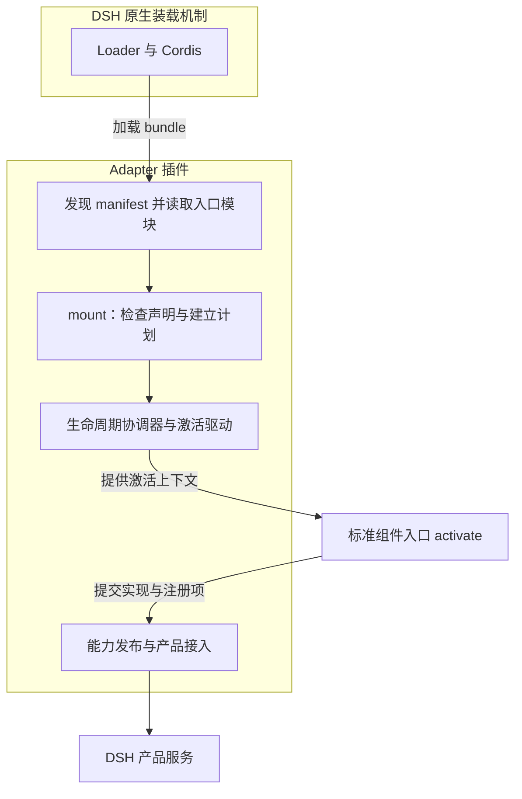

# 本项目 Adapter 的实现

`@dsh-std/adapter-dsh` 将标准组件接入 DeepSeek Harness。它本身作为 DSH 插件加载，使用 Cordis 管理运行关系，通过 `DshStandardAdapter` 组织标准组件的激活与能力接入。

整体作用见 [Adapter 设计](adapter-dsh.zh.md)，通用接口见 [Adapter 接入 std 所需接口](adapter-std-interfaces.zh.md)。

## 从安装到激活

Adapter 包是一个 DSH profile bundle。安装后，DSH 执行它的 `cordis.patch.yml`，加载 Adapter 并传入当前 profile 的位置。

```sh
dsh plugin --profile web add @dsh-std/adapter-dsh
dsh plugin --profile web add <standard-component>
```

Adapter 读取 profile 的普通 dependencies，找到各包中的 `dsh-plugin.json`，校验并转换为标准组件声明。对于采用 `lifecycle.dsh/v1alpha1`、`FacetModule` 激活类型的 facet，它解析包内入口模块，取得模块导出的激活函数，再交给 `mount()`。

`mount()` 检查该 facet 的声明与需求，建立激活计划，然后调用生命周期协调器。协调器创建本次实例和激活上下文；激活驱动调用模块的 `activate(context)`。



## 基础管理对象

`DshStandardAdapter` 使用以下对象组织接入：

| 对象 | 在本实现中的用途 |
| --- | --- |
| 协议规则库与声明规则库 | 解释组件声明，检查所需协议和扩展的格式 |
| 组合规则与激活驱动 | 建立 facet 的激活安排，并调用其入口 |
| 生命周期协调器 | 管理实例、暂存实现、发布和停止 |
| 已发布能力表 | 保存实例当前提供的协议实现与扩展 |
| 连接端点 | 向组件提供协商后的 API，并接入已发布实现 |
| 组件与 facet 记录 | 保存已挂载对象及其产品接入、停止操作 |

## 怎样接入产品能力

该实现将插件发布的能力接入 DSH，同时提供 DSH 服务对应的标准调用接口。

| 能力 | 接入方式 |
| --- | --- |
| 命令 | 建立标准命令目录和 `CommandRuntime`；产品 UI 提供对应位置的 provider 后，接入其原生命令入口 |
| 模型 | 将组件提供的模型处理函数接入 LLM registry，并提供 `ModelCatalog` |
| 工具 | 将工具及工具替换接入 Agent 的工具运行环境 |
| Skill | 将组件资源接入原生 Skill provider registry，按具体请求读取包内 Markdown |
| 会话 | 使用 `sessionController` 提供 `SessionCatalog` 的 list/get/create/rename，以及 `SessionHistory` 的 read/follow |
| 浏览器 UI | 通过 client module transport 加载标准浏览器模块，接入 settings section、tool call view 等 surface |

以命令组件为例：manifest 声明命令，入口在激活上下文中发布处理函数；激活成功后，命令进入标准目录并可通过 `CommandRuntime` 调用。产品 UI 注册相应位置的 provider 后，该命令还可以进入该 UI 的命令入口。卸载时，命令和产品接入按本次实例撤销。

组件取得协议 API 时，Adapter 为本次实例创建连接端点，并与自身端点建立内存连接。协商后的 client 进入激活上下文，连接释放操作关联到实例清理范围。

## 卸载与清理

`mount()` 返回异步卸载函数。卸载时，Adapter 移除产品注册和连接声明，再交给生命周期协调器停止实例、调用停止回调并释放登记的资源。

Adapter 自身由 Cordis 销毁时，也会逐项停止它管理的 facet，并清理产品 provider 与浏览器模块记录。

## 其他接入入口

集成方可以直接调用 `mount()`，提交组件声明、facet 名称和激活函数。

需要先提供宿主内建能力时，可以设置 `discover: false` 启动基础 Adapter，再加载 `@dsh-std/adapter-dsh/profile-loader` 执行标准组件的发现与激活。

本包通过 `peerDependencies` 声明 DSH 产品依赖范围。代码与配置见 [Adapter 包](../../packages/adapter-dsh)。
