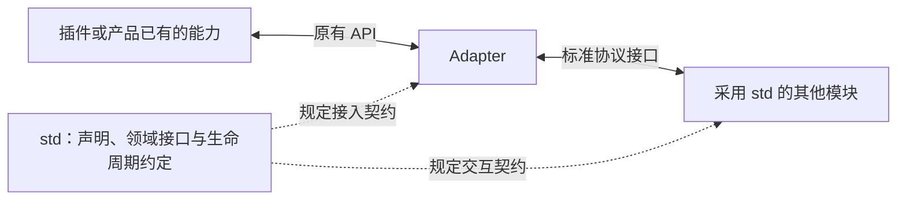

# Adapter 设计

- 文档类型：设计提案
- 状态：草案

## Adapter 是什么

Adapter 是连接已有实现与标准接口的适配层。插件使用自己的 API 和运行方式，std 提供共同的协议；Adapter 负责把两者接起来，让插件提供的能力可以按标准接口使用。

例如，一个插件提供命令处理函数。接入 std 时，需要说明命令是什么、怎样调用，以及停止插件时怎样撤销它。Adapter 将这些工作接入 std 的声明、调用和生命周期接口。模型、工具或 UI 能力也可以通过各自的领域协议接入。

不同项目可以自行设计 Adapter。每个 Adapter 负责自己的适配对象，独立运行；共同采用的 std 协议使它们能够与其他标准模块配合。

## Adapter 在 std 中的位置

std 规定协议身份、需求与支持的声明方式，以及相应的调用和生命周期语义。Adapter 实现具体对接：把标准调用交给插件或产品服务，再把结果按协议返回。

Adapter 的内部结构由实现者组织。它可以复用标准包提供的部件，也可以实现相同的协议语义。

## Adapter 负责什么

Adapter 的工作可以从两个方向理解。

**使用能力时**，Adapter 声明插件需要哪些协议，并把已经协商的调用接口交给插件。例如，命令插件需要读取会话时，通过会话协议取得相应 API。

**提供能力时**，Adapter 声明并发布插件的实现，使其他模块可以调用。例如，模型插件提供一个模型接口，Adapter 将它接入对应标准协议。

当 Adapter 负责插件的启动与停止时，还要关联实例和注册项：哪些能力由本次实例提供，哪些资源在停止或失败后需要释放。这样，调用方可以知道能力何时可用，宿主可以在实例退出时撤销相应注册。

## 标准组件与原生插件

标准组件通过 manifest 描述自己的身份、入口、依赖与贡献。一个组件可以有多个 facet，每个 facet 分别声明和激活。Adapter 读取这些信息，接入相应的标准接口。

原生插件使用原有装载方式和产品 API。为它增加 std 兼容能力时，Adapter 提供所需的标准声明与接口，并把注册项和清理操作关联到实际运行实例。

这两种情况都需要确定提供或使用哪些标准能力，以及这些能力的运行归属。接入清单按承担的职责给出对应接口。

## 本项目的实现与接入说明

`@dsh-std/adapter-dsh` 是本项目提供的 Adapter 产品，供集成方使用，减少重复对接 DSH API 的工作。

- [本项目 Adapter 的实现](adapter-dsh-reference.zh.md)：介绍它怎样加载标准组件、组织激活，并接入 DSH 产品能力。
- [Adapter 接入 std 所需接口](adapter-std-interfaces.zh.md)：列出自行实现或修改 Adapter 时需要对接的接口、输入输出和调用约定。
